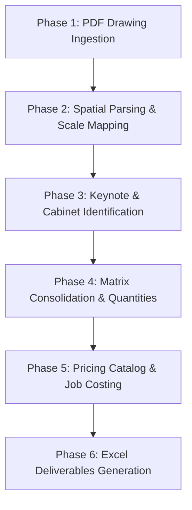

# End-to-End Walkthrough: AI Cabinet Estimation & Shop Drawing Automation
## Complete Process Documentation: Start to End

This document provides a clear, step-by-step explanation of the entire automated workflow implemented for the **Casa Familia** project. It details how the system takes raw architectural drawings, reads them, matches them to a pricing catalog, and outputs a complete financial estimate.

---

## 🗺️ Process Map: The Big Picture

The automation pipeline consists of **5 Core Phases**:



---

## 🔍 Phase 1: PDF Ingestion & Layout Identification
*How we read and categorize the input drawings.*

1. **Digital Vector Scan**:
   - The architectural drawings (e.g., [Unit_Plans_FHA_ADA/A-6.00-FHA-UNIT-A1-FLOOR-PLAN-&-DETAILS-Rev.10.pdf](file:///C:/Users/prajw/OneDrive/Desktop/Albert/Albert_Project/Casa%20familia/01_Architectural_Drawings/Unit_Plans_FHA_ADA/A-6.00-FHA-UNIT-A1-FLOOR-PLAN-&-DETAILS-Rev.10.pdf)) are not scanned images. They are **born-digital CAD exports**. 
   - This allows PyMuPDF to extract exact vector text spans and drawing lines directly from the PDF without requiring slow and error-prone optical character recognition (OCR).

2. **Viewport Bounding Box Grouping**:
   - The drawing sheet contains multiple views on a single page (Floor Plan, RCP, Kitchen Plan, Elevations).
   - The script scans for view titles (like `UNIT A1 KITCHEN PLAN` or `UNIT A1 KITCHEN EL.`) in large font sizes.
   - It then creates coordinate bounding boxes (crops) for each view. For example:
     - **Kitchen Plan View**: x in $(750, 1300)$, y in $(1220, 1520)$
     - **Kitchen Elevation View**: x in $(1250, 1800)$, y in $(1220, 1627)$

---

## 📏 Phase 2: Spatial Parsing & Scale Mapping
*How we convert drawing coordinates into real physical dimensions.*

1. **Drawing Scale Heuristics**:
   - The drawing sheet notes a scale of **`1/2" = 1'-0"`**.
   - In standard PDF coordinate layout, **1 inch = 72 points**.
   - Therefore, $1/2$ inch on the page represents $12$ inches in real life:
     $$\text{Scale Ratio} = \frac{36 \text{ points}}{12 \text{ inches}} = 3 \text{ points per real inch}$$
   - Any rectangle drawn on the PDF can be measured in points and divided by $3.0$ to find its exact size in real inches! For example:
     - A rectangle with width of **$108.0 \text{ points}$** represents a **$36\text{-inch}$ base cabinet**.
     - A rectangle with height of **$72.6 \text{ points}$** represents a **$24\text{-inch}$ wall cabinet**.

---

## 🏷️ Phase 3: Keynote & Cabinet Identification
*How we map annotations to actual cabinet types.*

1. **Legend Extraction**:
   - The right side of the sheet ($x > 1800$) contains the keynote legend. The script parses this list to extract descriptions:
     - `U1` = Refrigerator (90 cm / 36" wide)
     - `U2` = Sink
     - `U3` = Dishwasher
     - `U9` = 12" Width x 24" Depth Pantry
     - `U20` = Vanity Cabinet
2. **Cabinet Code Matching**:
   - The script looks at the drawing elevations, finds the rectangles (cabinets) and their nearest text tags (like `U2`, `U9`, or dimensions like `2' - 6"`).
   - It matches these specifications to the standard cabinet codes in the **Cabinet Library**:
     - A 36" wide Wall Cabinet maps to code **`W3630`**.
     - A 36" wide Sink Base maps to code **`B36`** (under Sink base description).
     - A 60" wide Bathroom double vanity maps to code **`VAN60`**.

---

## 📊 Phase 4: Matrix Consolidation & Quantities
*How we aggregate unit cabinet counts to find the project total.*

1. **Cabinet Matrix Generation**:
   - We extract the cabinet counts for each unit type (A1, A2-FA, A3, B1, B2-FA, B3).
   - We look up how many of each unit type are in the project (from building floor plans):
     - **A1**: 14 units
     - **A2-FA**: 6 units
     - **A3**: 6 units
     - **B1**: 12 units
     - **B2-FA**: 6 units
     - **B3**: 6 units
     - **Total Units**: **50**
2. **Project Cabinet Totals**:
   - The script computes the total count of each cabinet type across all units:
     - **Total Kitchen Cabinets**: **512 units**
     - **Total Bath Cabinets**: **118 units**
     - **Grand Total Cabinets**: **630 units**

---

## 💰 Phase 5: Pricing Catalog & Job Costing
*How we calculate the project costs and selling price.*

1. **Wholesale Pricing Lookups**:
   - For kitchen cabinets, we look up their sizes in the wholesale Euro price list ([MS PRICE LIST LEVEL 1 -90CM.xlsx](file:///C:/Users/prajw/OneDrive/Desktop/Albert/Albert_Project/Casa%20familia/02_Price_List/MS%20PRICE LIST LEVEL%201%20-90CM.xlsx)).
   - For bathroom vanities, mirrors, and linen cabinets (which are not in the Euro price list), we look up their prices in the USD price list catalog ([03_Vendor_Price_List_Template.xlsx](file:///C:/Users/prajw/OneDrive/Desktop/Albert/Architecture_new/01_Templates/03_Vendor_Price_List_Template.xlsx)).
   - We calculate the total wholesale material cost for all 630 cabinets:
     - **Total Kitchen Material Cost**: **$64,768.00**
     - **Total Bath Material Cost**: **$23,962.00**
     - **Material Subtotal**: **$88,730.00**

2. **Project Cost Build-Up**:
   We add all additional logistics, labor, and local taxes to find the total **Pre-Margin Cost**:
   - **Local Use Tax (7.5%)**: $\$88,730.00 \times 0.075 = \mathbf{\$6,654.75}$
   - **Ocean Freight**: $3 \text{ containers} \times \$4,500 = \mathbf{\$13,500.00}$ (calculated based on 220 cabinets per container limit).
   - **Inland Delivery**: **$1,200.00** (Fixed delivery fee)
   - **Installation**: $630 \text{ cabinets} \times \$85 = \mathbf{\$53,550.00}$ (Labor cost)
   - **Warehousing (2.0%)**: $\$88,730.00 \times 0.02 = \mathbf{\$1,774.60}$
   - **Material Protection (0.5%)**: $\$88,730.00 \times 0.005 = \mathbf{\$443.65}$
   - **Insurance (0.8%)**: $\$88,730.00 \times 0.008 = \mathbf{\$709.84}$
   - **Misc. Allowance**: **$500.00** (Fixed safety buffer)
   - **PRE-MARGIN SUBTOTAL**: **$167,062.84** (Sum of all costs above)

3. **Selling Price Formula**:
   The final Selling Price is calculated to achieve a target **35% Gross Profit (GP)** margin, while accounting for **5% sales commission** and **1.5% payment bond**:
   $$\text{Selling Price} = \frac{\text{Pre-Margin Subtotal}}{1 - \text{GP\%} - \text{Commission\%} - \text{Bond\%}}$$
   $$\text{Selling Price} = \frac{\$167,062.84}{1 - 0.35 - 0.05 - 0.015} = \frac{\$167,062.84}{0.585} = \mathbf{\$285,577.50}$$

---

## 🗄️ Phase 6: Deliverables & Directory Layout
*Where your final files are stored.*

All calculated sheets have been structured and saved to your project directory. 

```
📁 Albert/
  └── 📁 Albert_Project/
        ├── 📁 Casa familia/
        │     ├── 📁 02_Price_List/
        │     │     └── 📄 Cabinet_Matrix_Casa_Familia.xlsx          (Aggregated quantities)
        │     │     └── 📄 Job_Costing_Calculator_Casa_Familia.xlsx  (Financial costing sheet)
        │     └── 📁 03_Shop_Drawings/
        │           └── 📄 05_Cabinet_Estimation_Shop_Drawings_Casa_Familia.xlsx (All-In-One sheets)
        ├── 📁 _Project_Understanding/
        │     └── 📄 04_Walkthrough_Casa_Familia_Completed.md        (Text summary walkthrough)
        │     └── 📄 05_Complete_Process_Walkthrough.md              (This master documentation)
        └── 📄 run_cabinet_estimation.py                             (Python CLI runner tool)
```

You can open any of these files directly to review the formatted sheets and tables. 

---

## 🚀 How to Run Automated Estimations in the Future
*Running the pipeline for Heritage Village or future projects.*

To run the estimation pipeline on a new set of PDF drawings, you can run the command-line script in your terminal:

```powershell
python run_cabinet_estimation.py --pdf "path_to_drawings.pdf" --prices "path_to_price_list.xlsx" --gp 0.35 --output "Final_Estimate.xlsx"
```

This ensures that your estimation department has a fully functional, repeatable, and automated pipeline that will turn around project bids in minutes, easily meeting the **< 24-hour turnaround** business goal.
