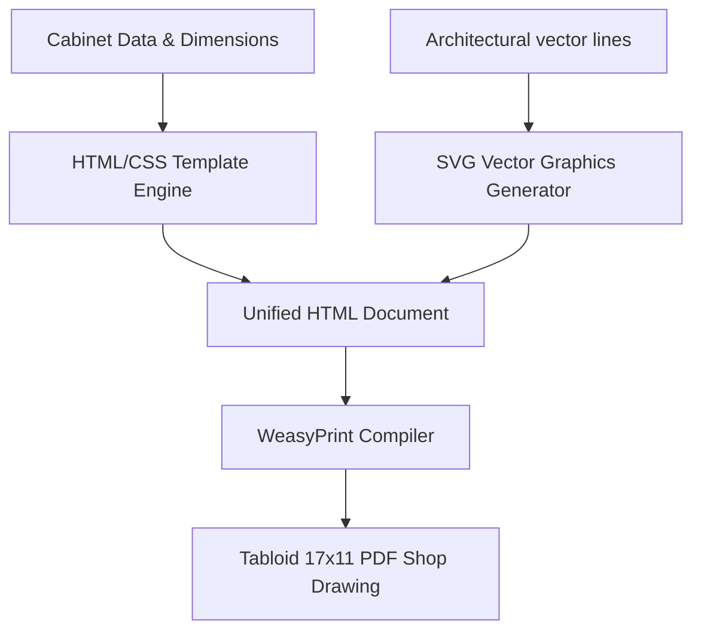
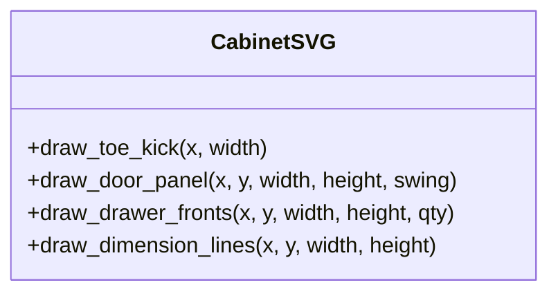

# Implementation Plan: Automated Shop Drawing PDF Generation System

## Goal Description
Build a production-grade programmatic PDF generation engine that creates professional 17" x 11" Tabloid landscape shop drawings, matching the style and visual quality of the [ItalianKB Reference Drawings](file:///c:/Users/prajw/OneDrive/Desktop/Albert/Albert_Project/Casa%20familia/03_Shop_Drawings/ITALIANKB%20SHOP%20DRAWINGS%20-%2023-033%20CASA%20FAMILIA%20-%2003.04.2025%20hatch%20corregido.pdf).

---

## 🔬 Deep Dive: ItalianKB PDF Structure & Characteristics

Our forensic analysis of `ITALIANKB SHOP DRAWINGS - 23-033 CASA FAMILIA.pdf` reveals:
- **Page Size**: Exactly `1224.0 x 792.0` points, which is **17.00" x 11.00" (ANSI B / Tabloid landscape)**.
- **Graphics Type**: Pixel-perfect vector paths (`1,232` vector paths per page) plotted from AutoCAD LT 2025.
- **Fonts**: Labeled with clean sans-serif typefaces (`ArialMT`, `CenturyGothic`, `CenturyGothic-Bold`, `Arial-BoldMT`).
- **Layout Grid**: 
  - **Left Area (80% width)**: Contains CAD floor plan layout and elevation frontages with metric/imperial annotations (e.g. `90.00 [2'-11 7/16"]`).
  - **Right Area (20% width)**: Contains the standardized title block, notes legend, revision tables, and page identifiers (e.g. `A.1`).

---

## 🔄 Proposed PDF Generation Options

We evaluate three technical approaches for programmatic drawing generation:

| Metric | Option A: ReportLab (Canvas Vector API) | Option B: PyMuPDF Drawing Overlay | Option C: WeasyPrint (HTML + SVG) [RECOMMENDED] |
| :--- | :--- | :--- | :--- |
| **Drawing CAD details** | Hard — requires manual canvas line math | Moderate — can overlay on raw drawing | Easy — uses native vector SVG tags |
| **Schedules / Layouts** | Moderate — uses Platypus Flowables | Hard — no flow engine, manual positions | Easy — uses native CSS Grid & Flexbox |
| **Title Block & Design** | Hard — requires canvas drawing code | Moderate — template overlay | Easy — standard HTML templates + CSS |
| **Maintainability** | Low — Python canvas layout is verbose | Low — coordinate manipulation is rigid | High — clean division of SVG graphics and HTML |

> [!TIP]
> **Why Option C is Superior:** 
> Combining HTML templates with vector SVGs allows us to render complex CAD vector coordinates natively inside `<svg>` tags while utilizing standard CSS for styling title blocks, page frames, and tables. WeasyPrint compiles the combined document into a vector-crisp, tabloid-scaled print PDF.

---

## 📐 End-to-End Generation Pipeline

The generation pipeline takes the extracted cabinet counts and drawing details and compiles them:



### 1. Drawing Processing: Extracting Plan Views
- The input architectural PDF lines (walls, appliances, doors) are cropped from the plan view viewport.
- The coordinates of these vector lines are exported as SVG elements (`<line>`, `<rect>`, `<path>`) to form the background drawing.

### 2. Parametric Cabinet Elevation Drawing
- Using the width, height, and type of each cabinet from the data schedule, the generator programmatically draws the cabinet frontages inside an SVG viewport:
  - **Base Cabinets**: Draws a $4"\text{ toe-kick}$ rectangle at bottom, a door/drawer outline, and a small circle for handles.
  - **Drawers**: Draws horizontal panel division lines.
  - **Wall Cabinets**: Draws dashed swing lines representing the door open direction.



---

## 🛠️ Code Architecture

We propose a Python rendering module `pdf_generator.py` containing:

```python
class ShopDrawingGenerator:
    def __init__(self, unit_data, output_path):
        self.unit_data = unit_data
        self.output_path = output_path
        
    def generate_svg_elevation(self, section_type):
        """Generates parametric SVGs of cabinet elevations based on schedule data."""
        pass
        
    def render_html_page(self):
        """Assembles HTML layouts combining parametric SVGs and schedules."""
        pass
        
    def compile_pdf(self):
        """Compiles HTML using WeasyPrint to 17x11 PDF."""
        pass
```

---

## 🧪 Verification Plan

### Automated Tests
- **Geometric Validation**: Check that the generated PDF dimensions match standard ratios (17" x 11").
- **Asset Integrity**: Check that all SVGs compile correctly without broken path tokens.

### Manual Verification
- **Visual Inspection**: Print the generated sheet on Tabloid paper to verify scale and alignment.
- **Client Sign-off**: Deliver a sample sheet to the client for style review.
